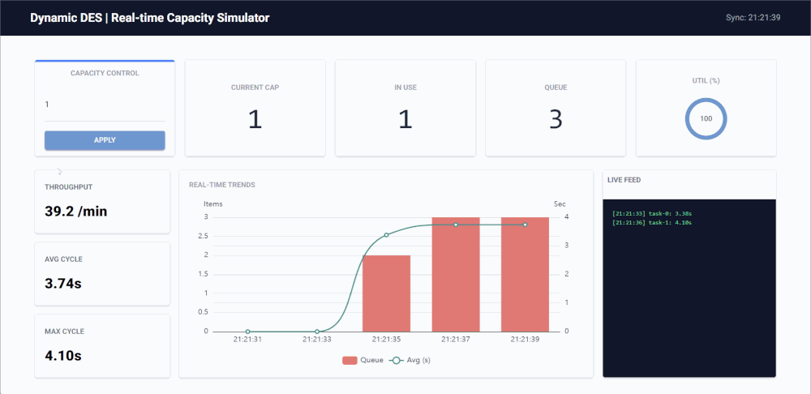

# Getting Started

This guide illustrates how to install Dynamic DES, run the built-in examples, and build your own real-time simulation. You can see the live control dashboard from the built-in Kafka example below.

<div align="center">
  
</div>

## Installation

Install the core library:

```bash
pip install dynamic-des
```

To include specific backends:

```bash
# For Kafka support
pip install "dynamic-des[kafka]"

# For Kafka and Dashboard support
pip install "dynamic-des[kafka,dashboard]"

# For all backends (Kafka, Redis, Postgres, Dashboard)
pip install "dynamic-des[all]"
```

---

## Quick Start: Zero-Setup Demos

Dynamic DES comes with built-in examples and infrastructure orchestration so you can see it in action immediately.

**Run the local, dependency-free simulation:**

```bash
ddes-local-example
```

**Run the full Real-Time Digital Twin stack with Kafka and a live UI:**

```bash
# Start the background Kafka cluster (requires Docker)
ddes-kafka-infra-up

# Open a new terminal and run the simulation
# Ctrl + C to stop
ddes-kafka-example

# Open a new terminal and start the monitoring dashboard (opens in browser)
# Visit http://localhost:8080
# Ctrl + C to stop
ddes-kafka-dashboard

# Clean up the infrastructure when finished
ddes-kafka-infra-down
```

---

## Building Your Own Simulation (Local Example)

The following snippet demonstrates a simple example. It initializes a production line, schedules an external capacity update, and streams telemetry to the console.

```python
import numpy as np
from dynamic_des import (
    CapacityConfig, ConsoleEgress, DistributionConfig,
    DynamicRealtimeEnvironment, DynamicResource, LocalIngress, SimParameter
)

# 1. Define initial system state
params = SimParameter(
    sim_id="Line_A",
    arrival={"standard": DistributionConfig(dist="exponential", rate=1)},
    resources={"lathe": CapacityConfig(current_cap=1, max_cap=5)},
)

# 2. Setup Environment with Local Connectors
# Schedule capacity to jump from 1 to 3 at t=5s
ingress = LocalIngress([(5.0, "Line_A.resources.lathe.current_cap", 3)])
egress = ConsoleEgress()

env = DynamicRealtimeEnvironment(factor=1.0)
env.registry.register_sim_parameter(params)
env.setup_ingress([ingress])
env.setup_egress([egress])

# 3. Create Resource
res = DynamicResource(env, "Line_A", "lathe")

def telemetry_monitor(env: DynamicRealtimeEnvironment, res: DynamicResource):
    """Streams system health metrics every 2 seconds."""
    while True:
        env.publish_telemetry("Line_A.resources.lathe.capacity", res.capacity)
        yield env.timeout(2.0)


env.process(telemetry_monitor(env, res))

# 4. Run
print("Simulation started. Watch capacity change at t=5s...")
try:
    env.run(until=10.1)
finally:
    env.teardown()
```

### What this does

1.  **Registry Initialization**: The `SimParameter` defines the initial state. The Registry flattens this into addressable paths (e.g., `Line_A.resources.lathe.current_cap`).
2.  **Live Ingress**: The `LocalIngress` simulates an external event (like a Kafka message) arriving 5 seconds into the run.
3.  **Zero-Polling Update**: The `DynamicResource` listens to the Registry. The moment the ingress updates the value, the resource automatically expands its internal token pool without any manual checking.
4.  **Telemetry Egress**: The `ConsoleEgress` prints system vitals to your terminal, mimicking a live dashboard feed.

### More Examples

For more examples, including implementations using **Kafka** providers, please explore the [examples](https://github.com/jaehyeon-kim/dynamic-des/tree/main/src/dynamic_des/examples) folder.
