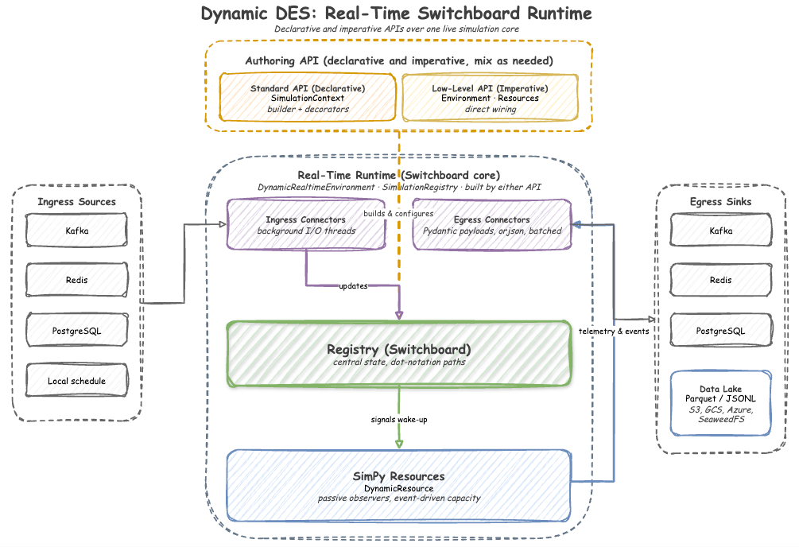

# Dynamic DES

**Dynamic DES** is a high-performance, real-time control plane for [SimPy](https://simpy.readthedocs.io/).

It bridges the gap between static discrete-event simulations and the live world by allowing you to update simulation parameters (arrivals, service times, capacities) and stream telemetry and events via **Kafka**, **Redis**, or **PostgreSQL** without stopping the simulation. It also transforms your models into **synchronized forecasting engines** by fast-forwarding through simulation time to predict future states or backfill Data Lakes with schema-enforced **Parquet** or **JSONL** files directly to **AWS S3, Google Cloud Storage (GCS), Azure Blob, and SeaweedFS** using PyArrow VFS.

  

---

## Key Features

- **⚡ Real-Time Control**: Synchronize SimPy with the system clock using `DynamicRealtimeEnvironment`.
- **🔗 Builder Pattern**: Construct digital twins declaratively with `SimulationContext` and decorators like `@app.task`.
- **🔗 Dynamic Registry**: Dynamic, path-based updates (e.g., `Line_A.arrival.rate`) that trigger instant logic changes.
- **🛡️ Enterprise Ready**: Native `**kwargs` passthrough for SASL, mTLS, OAuth, and AWS IAM Kafka clusters.
- **📦 Pluggable Serialization**: Stream lightweight JSON by default, or map specific ML topics to lazy-loaded **Avro/Schema Registry** serializers.
- **🗄️ Data Lake Ready**: Write chunked Parquet and JSONL datasets directly to object storage via PyArrow VFS, with built-in schema inference and drift prevention.
- **🦆 Pydantic Duck-Typing**: Seamlessly publish strictly-typed Pydantic V2 models straight from your simulation logic.
- **📊 System Observability**: Built-in lag monitoring to track simulation drift from real-world time.

---

## Documentation Layout

* **[Getting Started](getting-started.md)**: Quick installation and zero-setup demo commands.
* **Basics (Tutorials)**:
  * **[1. Your First Factory (Local)](tutorials/01-first-factory.md)**: Define a local factory lifecycle.
  * **[2. Adding Randomness and Rules](tutorials/02-distributions-resources.md)**: Add stochastic distributions and ingress scheduled capacity updates.
  * **[3. Going Distributed (Kafka)](tutorials/03-connecting-kafka.md)**: Connect standard simulation logic to live Kafka streams.
* **Core Architecture**:
  * **[Standard vs. Low-Level Paradigms](architecture/paradigms.md)**: Declarative vs. Imperative styles.
  * **[Simulation Context](architecture/context.md)**: Chained builder details and temporal factor control.
  * **[Realtime Environment](architecture/environment.md)**: Temporal clocks and async background threads.
  * **[Ingress and Egress Connectors](architecture/connectors.md)**: Input/output flows and tuning.
  * **[Resources and Containers](architecture/resources.md)**: Dynamic SimPy wrappers.
* **API Reference**:
  * **[API Reference](api.md)**: Technical reference for all public classes.
