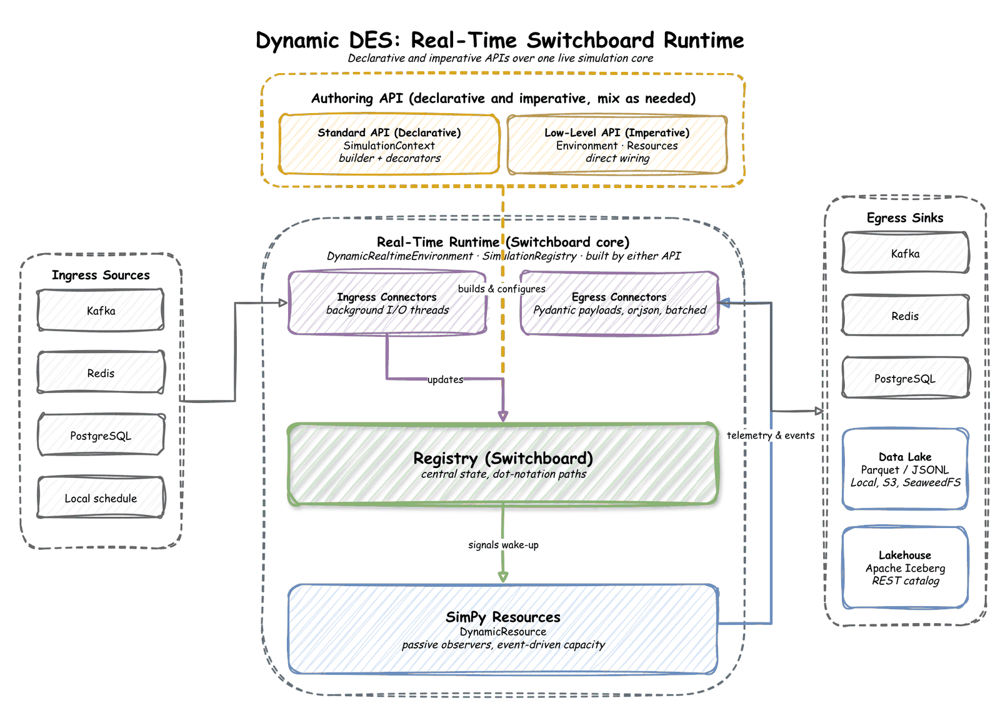

# Dynamic DES

**Dynamic DES** is a high-performance, real-time control plane for [SimPy](https://simpy.readthedocs.io/).

It bridges the gap between static discrete-event simulations and the live world by allowing you to update simulation parameters (arrivals, service times, capacities) and stream telemetry and events via **Kafka**, **Redis**, or **PostgreSQL** without stopping the simulation. It also transforms your models into **synchronized forecasting engines** by fast-forwarding through simulation time to predict future states or backfill Data Lakes with schema-enforced **Parquet** or **JSONL** files directly to **AWS S3, Google Cloud Storage (GCS), Azure Blob, and SeaweedFS** using PyArrow VFS.

  

---

## Key Features

- **⚡ Real-Time Control**: Synchronize SimPy with the system clock using `DynamicRealtimeEnvironment`.
- **🔗 Builder Pattern**: Construct digital twins declaratively with `SimulationContext` and decorators like `@app.task`.
- **🔗 Dynamic Registry**: Dynamic, path-based updates (e.g., `Line_A.arrival.rate`) that trigger instant logic changes.
- **🛡️ Enterprise Ready**: Native `**kwargs` passthrough for SASL, mTLS, OAuth, and AWS IAM Kafka clusters.
- **📦 Pluggable Serialization**: Stream lightweight JSON by default, or map specific ML topics to lazy-loaded **Avro/Schema Registry** serializers.
- **🗄️ Data Lake Ready**: Write chunked Parquet and JSONL datasets directly to object storage via PyArrow VFS, with built-in schema inference and drift prevention.
- **🦆 Pydantic Duck-Typing**: Seamlessly publish strictly-typed Pydantic V2 models straight from your simulation logic.
- **📊 System Observability**: Built-in lag monitoring to track simulation drift from real-world time.

---

## Documentation Layout

* **[Getting Started](getting-started.md)**: Install, clone the examples, and start the containers they need.
* **Basics (Tutorials)**:
    * **[1. Your First Factory (Local)](tutorials/01-first-factory.md)**: Define a local factory lifecycle.
    * **[2. Adding Randomness and Rules](tutorials/02-distributions-resources.md)**: Add stochastic distributions and ingress scheduled capacity updates.
    * **[3. Going Distributed (Kafka)](tutorials/03-connecting-kafka.md)**: Connect standard simulation logic to live Kafka streams.
* **Core Architecture**:
    * **[Standard vs. Low-Level Paradigms](architecture/paradigms.md)**: Declarative vs. Imperative styles.
    * **[Simulation Context](architecture/context.md)**: Chained builder details and temporal factor control.
    * **[Realtime Environment](architecture/environment.md)**: Temporal clocks and async background threads.
    * **[Ingress and Egress Connectors](architecture/connectors.md)**: Input and output flows, fan-out and tuning.
    * **[Resources and Containers](architecture/resources.md)**: Dynamic SimPy wrappers.
* **Examples**, every script in the `examples/` folder, in both API styles:
    * **Standard API (Declarative)**: [Local](examples/declarative/local.md), [Kafka](examples/declarative/kafka.md), [Data Lake](examples/declarative/history.md), [Postgres](examples/declarative/postgres.md), [Redis](examples/declarative/redis.md).
    * **Low-Level API (Imperative)**: [Local](examples/imperative/local.md), [Kafka](examples/imperative/kafka.md), [Data Lake](examples/imperative/history.md), [Postgres](examples/imperative/postgres.md), [Redis](examples/imperative/redis.md).
* **Integration Guides**, getting data in and out:
    * **[Backfill Then Go Live in One Run](guides/backfill-then-live.md)**: History unpaced, then a real-time tail, from one call.
    * **[Complex Routing (Kafka)](guides/complex-routing.md)**: Send records to different topics from one run.
    * **[Advanced Serialization (Avro and Pydantic)](guides/avro-and-pydantic.md)**: Schema-validated binary payloads.
    * **[Connecting to Secure Kafka](guides/kafka-security.md)**: SASL, mTLS, OAuth and AWS IAM.
* **Modelling Patterns**, shaping what the simulation does:
    * **[Multi-Resource Handoffs](guides/multi-resource-handoffs.md)**: One task holding several resources.
    * **[Preemptive Machine Breakdowns](guides/preemptive-breakdowns.md)**: Interrupting work already in progress.
    * **[Absolute Edge Cases (Dynamic Topology)](guides/dynamic-topology.md)**: Changing the model while it runs.
* **[API Reference](api.md)**: Technical reference for all public classes.
