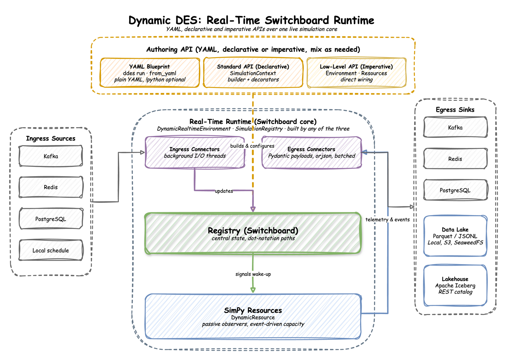
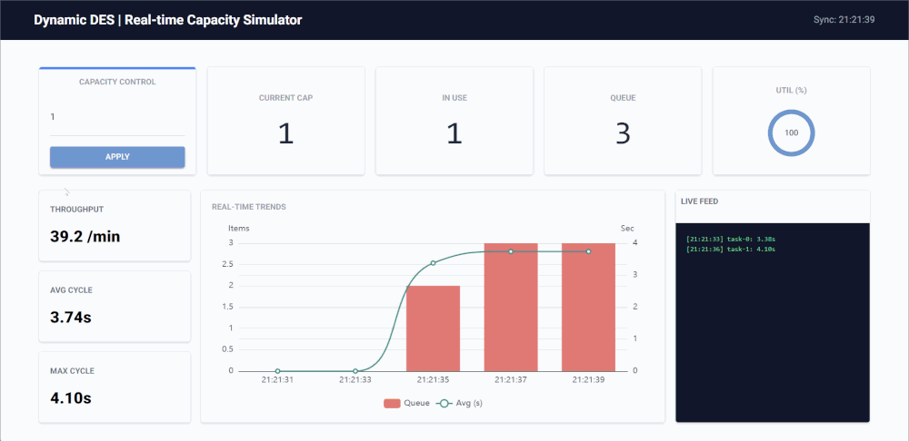

# Dynamic DES

Dynamic DES runs [SimPy](https://simpy.readthedocs.io/) discrete-event simulations in step with the system clock, or as fast as the machine allows. A running simulation takes parameter changes (arrival rates, service times, capacities) from **Kafka**, **Redis**, **PostgreSQL** or a timed scenario, without stopping. Its task events and telemetry go to the sinks you attach: **Kafka**, **Redis**, **PostgreSQL**, **Parquet** or **JSONL** files on local disk or **S3-compatible storage** such as AWS S3 or SeaweedFS, or an **Apache Iceberg** table through a REST catalog.

  

The control dashboard changes simulation parameters while a run is going, and the telemetry reacts without a restart:

  

---

## Key Features

- **Real time or full speed**: `DynamicRealtimeEnvironment` runs SimPy in step with the system clock, or unpaced, and reports how far the simulation lags behind real time.
- **Live parameters**: arrival rates, service times and capacities change mid-run through registry paths such as `Line_A.arrival.standard.rate`. A resource grows at once, and shrinks only as busy units are released, so no work in progress is lost.
- **Several sinks per run**: each sink added with `add_egress` has its own `when` filter, `batch_size` and `flush_interval`, so one run can feed a stream and a data lake together.
- **Backfill then go live**: one run generates backdated history at full speed, then switches to real time at `go_live_at`.
- **Three ways to write a simulation**: the low-level `DynamicRealtimeEnvironment`, the declarative `SimulationContext` builder, or a YAML blueprint run with `ddes run`.
- **Serialisation**: JSON through `orjson` by default, Avro through the Confluent or AWS Glue Schema Registry for chosen topics, and Pydantic models published as they are.
- **Kafka security**: extra keyword arguments go to the Kafka client, so SASL, mTLS, OAuth and AWS IAM clusters work.

---

## Documentation Layout

* **[Getting Started](getting-started.md)**: Install, download the examples, and start the containers they need.
* **Tutorials**, one factory written three ways:
    * **[Part 1: Low-level API](tutorials/low-level.md)**: Build the factory on `DynamicRealtimeEnvironment`, with SimPy processes started by `env.process`.
    * **[Part 2: Declarative API](tutorials/declarative.md)**: Build the factory with `SimulationContext`, add randomness and scheduled capacity changes, then connect it to Kafka.
    * **[Part 3: YAML](tutorials/yaml.md)**: Write the same factory as a blueprint and run it with `ddes run`.
* **Core Architecture**:
    * **[Overview](architecture/overview.md)**: The three ways to write a simulation, and the parameters and environment they share.
    * **Writing a simulation**: [Low-level API](architecture/low-level.md), [Declarative API](architecture/context.md), [YAML Blueprints](architecture/yaml.md).
    * **Runtime**: [Realtime Environment](architecture/environment.md), [Registry and Live Parameters](architecture/registry.md), [Time](architecture/time.md), [Resources and Containers](architecture/resources.md), [Connectors](architecture/connectors.md), [Records and Telemetry](architecture/records.md), [Batching and Delivery](architecture/batching.md).
* **Guides**:
    * **Connectors**: [Complex Routing (Kafka)](guides/complex-routing.md), [Advanced Serialization (Avro and Pydantic)](guides/avro-and-pydantic.md), [Connecting to Secure Kafka](guides/kafka-security.md).
    * **Features**: [Backfill Then Go Live in One Run](guides/backfill-then-live.md), [Change Parameters While a Simulation Runs](guides/live-parameters.md).
    * **YAML**: [YAML Blueprints, from First File to Connectors](guides/yaml-blueprints.md).
* **Advanced**: [Advanced YAML: Custom Logic with `!python`](guides/yaml-advanced.md), [Multi-Resource Handoffs](guides/multi-resource-handoffs.md), [Preemptive Machine Breakdowns](guides/preemptive-breakdowns.md), [Dynamic Topology (Resources Changed Mid-run)](guides/dynamic-topology.md).
* **Examples**, one page per example, with a tab for each way it is written. Backfill Then Go Live has declarative and YAML tabs, and the advanced orders example is YAML only: [Local](examples/local.md), [Kafka](examples/kafka.md), [Parquet](examples/parquet.md), [Iceberg](examples/iceberg.md), [Postgres](examples/postgres.md), [Redis](examples/redis.md), [Backfill Then Go Live](examples/backfill-live.md), [Orders with Line Items (Advanced YAML)](examples/advanced-postgres-orders.md).
* **[API Reference](api.md)**: Technical reference for all public classes.
* **About**: [Roadmap](about/roadmap.md), what is planned next and what 1.0 means.
